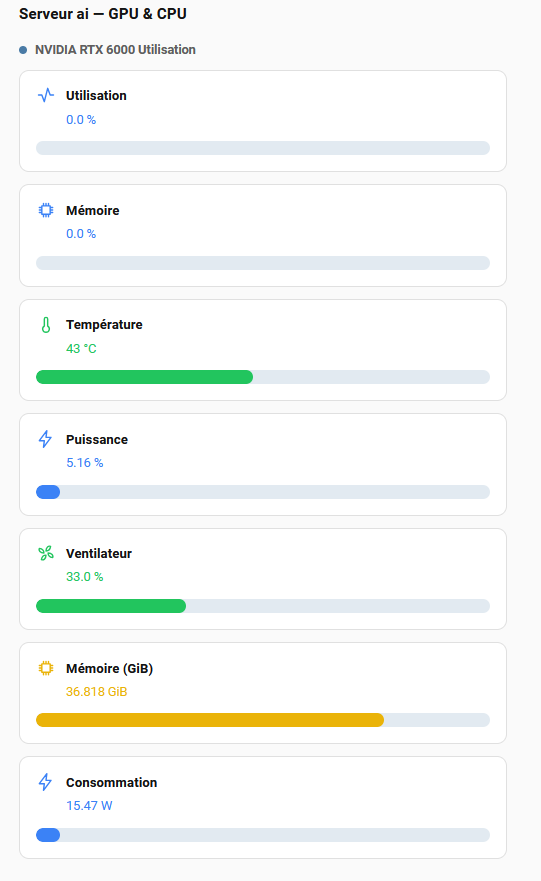

# NVIDIA GPU Stats — Home Assistant integration

A custom Home Assistant integration that shows **NVIDIA GPU statistics** as
sensors, ready to use with Lovelace `gauge` cards (percentages 0–100,
temperature 0–90 °C, power in watts, memory in GiB).

It does **not** talk to the GPU directly. It polls a tiny companion daemon —
[`NVIDIA_GPU_Metric_DEAMON`](https://github.com/thomasbidou/NVIDIA_GPU_Metric_DEAMON) —
that runs on the machine that actually has the GPU + `nvidia-smi`, and serves
the metrics as JSON over the LAN.

```
┌───────────────┐   HTTP GET /   ┌────────────────────┐
│  GPU box      │  ◄──────────── │  Home Assistant box │
│  nvidia-smi   │   JSON         │  nvidia_gpu int.   │
│  daemon:8790  │ ─────────────► │  (this repo)        │
└───────────────┘                └────────────────────┘
```

## What it creates

One device **per GPU** (named after the GPU, e.g. **NVIDIA RTX 6000 Ada
Generation on `ai`**) plus one **system** device (the box's CPU + RAM). Sensors
and device identities are namespaced by **GPU UUID** and **box hostname**, so
multiple GPUs, CPUs, or boxes never collide.

Per GPU:

| Sensor | Device class | Notes |
|---|---|---|
| GPU usage | `percentage` | 0–100 |
| Memory usage | `percentage` | 0–100 |
| Memory used | `GiB` | value over max |
| Memory total | `GiB` | your VRAM ceiling |
| Power draw | `power` (W) | value over max |
| Power limit | `power` (W) | your power limit |
| Power usage | `percentage` | draw / limit |
| Temperature | `temperature` (°C) | gauge 0–90 |
| Fan speed | `percentage` | 0–100 |

On the system device (the box's CPU + RAM):

| Sensor | Device class | Notes |
|---|---|---|
| CPU usage | `percentage` | 0–100 |
| CPU temperature | `temperature` (°C) | from the box's thermal sensor |
| RAM used | `GiB` | value over total |
| RAM total | `GiB` | your RAM ceiling |
| RAM usage | `percentage` | used / total |

### Bundled Lovelace card

The integration ships a ready‑made Lovelace card —
`custom:nvidia-gpu-card` — that shows the GPU and the CPU/RAM in **one card**,
grouped by device, as a clean list of bar cards. Each metric shows an icon,
its name, its value, and a progress bar whose color reflects the level
(blue → green → yellow → red as the value climbs; e.g. temperature: 0–25 °C
blue, 25–50 green, 50–70 yellow, 70+ red). It's installed automatically
alongside the integration (no manual resource needed) and **auto‑detects your
sensors by their `nvidia_gpu_key` attribute**, so it works on any box and any
number of GPUs without you hard‑coding entity IDs.



To use it, drop this into a view:

```yaml
type: custom:nvidia-gpu-card
title: Serveur ai — GPU & CPU
```

That's it — the card finds the right sensors on its own. See
[`examples/lovelace_gauges.yaml`](examples/lovelace_gauges.yaml) for the
individual native `gauge` cards as an alternative.


Because each sensor carries the correct `device_class`, Lovelace `gauge` cards
get sensible ranges automatically — you only override `min`/`max` where you want
a custom span (e.g. temperature 0–90, power 0–300). See
[`examples/lovelace_gauges.yaml`](examples/lovelace_gauges.yaml) for a
ready‑to‑paste dashboard.

## Requirements

- Home Assistant (recent 2024+/2025+ core).
- The companion daemon running and reachable on the LAN.
- `aiohttp` — already present on any HA install that runs an aiohttp
  integration; declared as a requirement so HA resolves it if missing.

## Installation

### 1. Run the daemon on your GPU box

Clone and start
[`NVIDIA_GPU_Metric_DEAMON`](https://github.com/thomasbidou/NVIDIA_GPU_Metric_DEAMON).
Default address: `http://<gpu-box-ip>:8790/`.

### 2. Add this integration to Home Assistant

Option A — **copy the files** (works everywhere):

```bash
# on the HA box, into the config dir (HAOS: /homeassistant)
git clone https://github.com/thomasbidou/NVIDIA_GPU_Metric.git /tmp/nvgpu
cp -r /tmp/nvgpu/nvidia_gpu /homeassistant/custom_components/nvidia_gpu
```

Option B — **HACS**: add this repository as a custom repo
(`thomasbidou/NVIDIA_GPU_Metric`), then install **NVIDIA GPU Stats**.

Then **restart Home Assistant** — custom integrations are only discovered at
boot.

### 3. Configure

**Settings → Devices & Services → Add integration → “NVIDIA GPU Stats”**.
Enter the daemon's **host** (IP/hostname of the GPU box) and **port**
(default `8790`). The config flow probes the endpoint and shows the GPU name on
success.

## Lovelace gauges

Paste `examples/lovelace_gauges.yaml` into a dashboard's *Edit dashboard → raw
YAML* (or recreate the cards in the UI). It provides gauges for GPU %,
memory %, memory GiB (0–48), power draw W (0–300), power %, temperature
(0–90 °C, with orange/red thresholds), and fan %.

> Entity IDs follow HA's slug rule: device name + sensor name, lowercased,
> spaces → underscores (e.g. `sensor.nvidia_rtx_6000_ada_generation_gpu_usage`).
> If HA adds a numeric suffix, just re‑pick the sensor in the card's entity
> dropdown — the names are unambiguous.

## How it works

- `coordinator.py` — a `DataUpdateCoordinator` that `GET`s the daemon's `/`
  endpoint on each scan interval and caches the JSON.
- `sensor.py` — one `CoordinatorEntity` per metric (per GPU + system); each
  exposes a stable `nvidia_gpu_key` attribute so cards can identify it.
- `card.py` — ships the bundled Lovelace card into HA's `www/` and registers
  it as a frontend resource (auto‑managed; never clobbers your file).
- `config_flow.py` — validates the endpoint during setup so a bad address is
  caught up front.
- Poll interval defaults to **30 s** (the daemon itself polls `nvidia-smi`
  every 3 s, so you always read a fresh value).

## Files

```
nvidia_gpu/
  __init__.py        # setup/unload, builds the coordinator
  const.py           # domain + defaults
  coordinator.py     # HTTP polling coordinator
  config_flow.py     # UI setup flow (host + port)
  sensor.py          # the GPU + CPU/RAM sensors (per GPU)
  card.py            # ships + registers the bundled Lovelace card
  www/nvidia-gpu-card.js  # the custom card (custom:nvidia-gpu-card)
  manifest.json      # integration manifest
  strings.json       # user-facing strings
  translations/en.json
examples/
  lovelace_gauges.yaml
docs/
  nvidia-gpu-card.png
```

## Troubleshooting

- **Integration doesn't appear after install** → restart HA; it's only detected
  at boot.
- **Setup fails with “cannot reach”** → check the daemon is running
  (`curl http://<gpu-box-ip>:8790/health`), the port, and that the HA box can
  reach the GPU box's LAN/VLAN.
- **Sensors show `unavailable`** → the daemon is up but `nvidia-smi` failed;
  check `nvidia-smi` on the GPU box and the daemon's logs.

## License

MIT.
